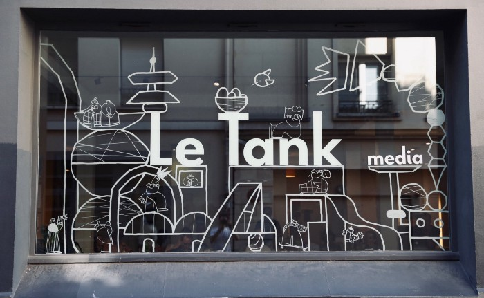

A l'invitation de [Le Tank Media](http://letankmedia.fr/), notre coopérateur [Sylvain Lapoix](https://twitter.com/SylvainLapoix) interviendra dans le cadre de [la première conférence Horizon(s) le 18 juillet 2019](https://medium.com/letank-media/horizon-s-repenser-les-m%C3%A9tiers-et-organisations-pour-mieux-r%C3%A9inventer-les-m%C3%A9dias-e5b4ab1a733b) consacrée au datajournalisme.

Sa présentation sur le thème **7 choses apprises en formant à la data** est en ligne au format HTML et sous licence [Creative Commons 4.0 BY-SA](https://creativecommons.org/licenses/by-sa/4.0/legalcode.fr) à la page : [https://datactivist.coop/letankmedia_confddj/](https://datactivist.coop/letankmedia_confddj/)

Contact : [sylvain@datactivist.coop](mailto:sylvain@datactivist.coop).